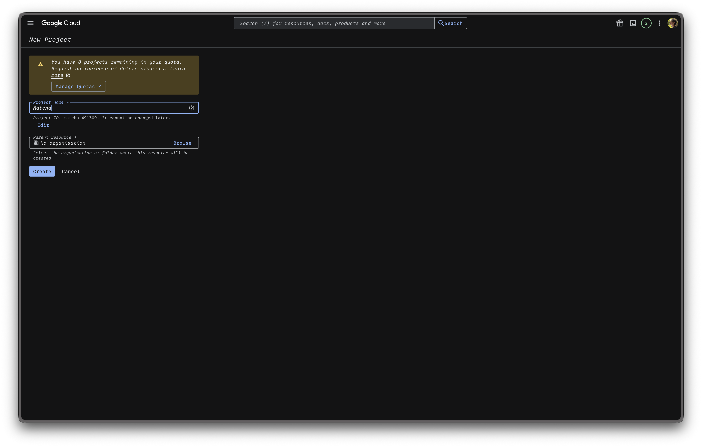
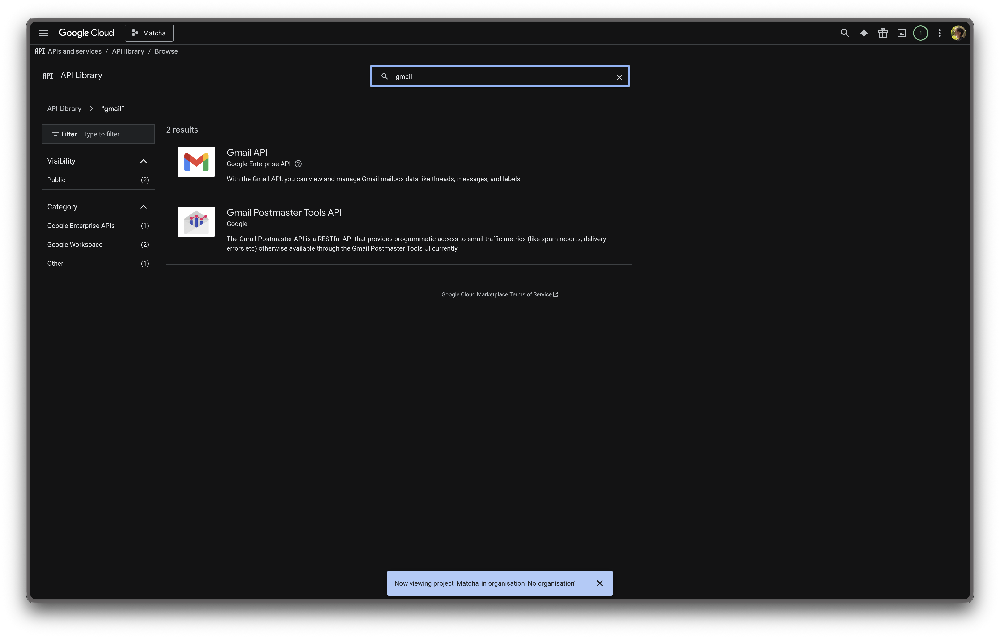
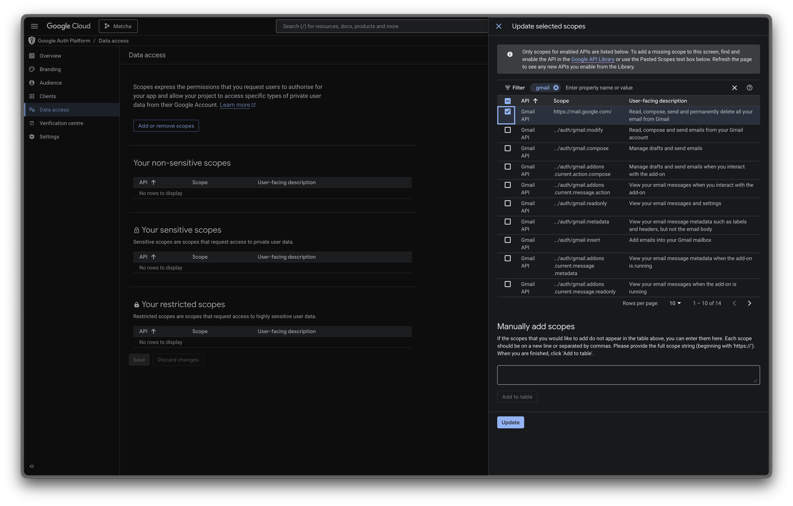
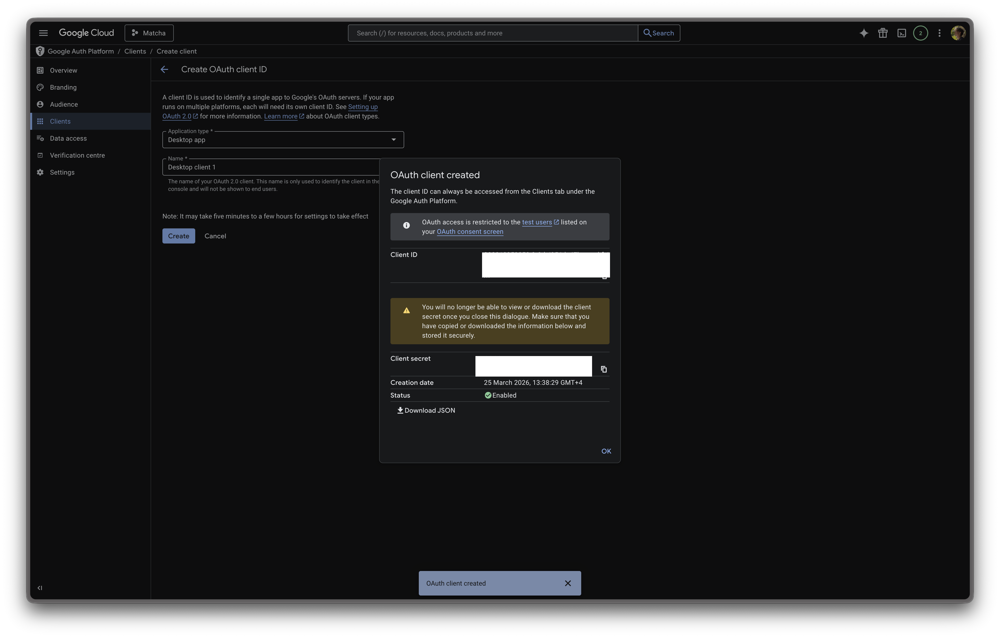
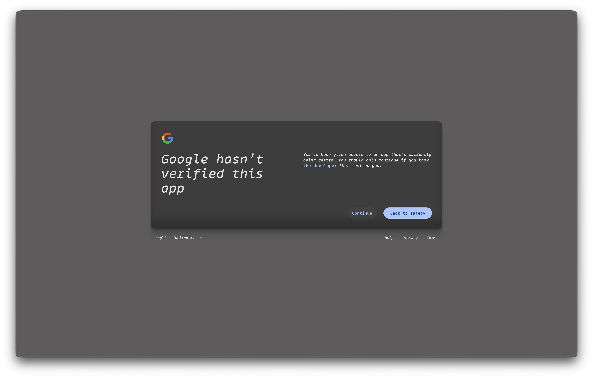
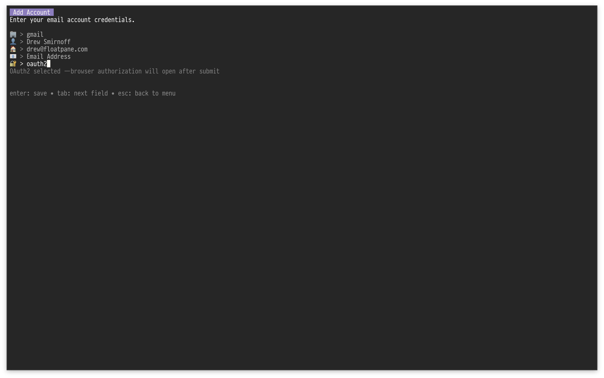

# Gmail setup

Matcha supports two ways to connect to Gmail:

- **OAuth2** (recommended) — sign in with your Google account in the browser, no app password needed
- **App Password** — generate a 16-character password from Google's security settings

---

## Option A: OAuth2 (recommended)

OAuth2 lets you authorize Matcha through Google's standard sign-in flow. No app passwords required.

### 1. Create a Google Cloud project

1. Go to [console.cloud.google.com](https://console.cloud.google.com).
2. Click the project dropdown at the top and select **New Project**.
3. Name it something like "Matcha" and click **Create**.

  

### 2. Enable the Gmail API

1. In the left sidebar, go to **APIs & Services** → **Library**.
2. Search for **Gmail API**.
3. Click it and press **Enable**.

  

### 3. Configure the OAuth consent screen

1. Go to **APIs & Services** → **OAuth consent screen**.
2. Select **External** as the user type and click **Create**.
3. Fill in the required fields:
   - **App name**: Matcha
   - **User support email**: your email
   - **Developer contact email**: your email
4. Click **Create**.
5. On the left sidebar, click **Data access**, search for `Gmail`, check it, and click **Update** → **Save**.
6. On the left sidebar, click **Audience**, then **Add Users** under **Test Users** enter your Gmail address, and click **Save**.

  

> **Note:** Your app will be in "Testing" mode, which is perfectly fine for personal use. Google will show an "unverified app" warning during sign-in — just click **Continue**. Tokens in testing mode expire after 7 days, after which you'll need to re-authorize with `matcha oauth auth your@gmail.com`.

### 4. Create OAuth credentials

1. Go to **Clients**.
2. Click **Create Client** at the top of the screen.
3. Application type: **Desktop app**.
4. Name: anything (e.g. "Matcha").
5. Click **Create**.
6. Copy the **Client ID** and **Client Secret**.

  

### 5. Authorize your Gmail account

Run the following command in your terminal, substituting your real client ID and secret:

```bash
matcha oauth auth your@gmail.com --client-id YOUR_ID --client-secret YOUR_SECRET
```

The credentials are saved to your operating system's keyring on first use.

A browser window will open. Sign in with your Google account and grant access. Once authorized, you'll see "Authorization complete!" in your terminal.

  
 > **Note**: click "Continue" here

### 6. Authorizing additional Gmail accounts

Matcha supports multiple Google accounts in two configurations: **shared client** (recommended for personal-only use) and **per-account override** (required when accounts must use different Google Cloud Projects, e.g. a personal account plus a Google Workspace account whose admin restricts third-party app access).

#### Shared OAuth Client (one Cloud Project, many accounts)

A single **OAuth 2.0 Client** in one **Google Cloud Project** can authorize any number of users — that's how OAuth is designed to work. After your first `oauth auth` call, the client ID and secret are stored as the **provider default** in the keyring. Any additional accounts can omit the flags:

```bash
matcha oauth auth second.personal@gmail.com
```

This is the right setup when:

- All your accounts are personal `@gmail.com` addresses, **or**
- You're authorizing several Workspace addresses that all live under the same Workspace org and Cloud Project.

Just remember to add each address to the **Test users** list on the consent screen of that one Cloud Project (unless the consent screen type is `Internal`, in which case any user in the Workspace org is automatically authorized).

#### Per-Account OAuth Client Override (multiple Cloud Projects)

Some scenarios require different OAuth Clients for different accounts:

- **Personal Gmail + Workspace Gmail.** Workspace admins typically restrict third-party OAuth apps and only allow OAuth Clients hosted in Cloud Projects owned by the Workspace org itself. Your personal Cloud Project can't authorize the Workspace mailbox.
- **Two Workspace accounts under different employers.** Each org's Workspace policy will only honor OAuth Clients in their own Cloud Project.

For each account that needs its own OAuth Client, create a separate OAuth 2.0 Client ID in the appropriate Cloud Project (Desktop app type), then run `oauth auth` with the matching `--client-id`/`--client-secret`. The credentials are stored under that specific email address as a **per-account override** and don't disturb the provider default.

```bash
# Personal account uses the default OAuth Client (saved on first auth)
matcha oauth auth personal@gmail.com --client-id PERSONAL_ID --client-secret PERSONAL_SECRET

# Workspace account uses a different OAuth Client from the work org's Cloud Project
matcha oauth auth you@yourcompany.com --provider gmail \
  --client-id WORKSPACE_ID --client-secret WORKSPACE_SECRET
```

The `--provider gmail` flag is required for Workspace accounts because Matcha can't auto-detect the provider from a custom domain. The provider is also stored in the keyring so subsequent token refreshes work without re-supplying it.

If your Workspace admin restricts third-party app access, they'll need to allowlist the OAuth Client ID in **Admin Console → Security → API Controls → App Access Control**. Without that, you'll see an "Access blocked: app has not completed verification" error regardless of which Cloud Project the OAuth Client lives in.

#### Rotating an OAuth Client secret

If you rotate a client secret in Google Cloud Console, re-running `matcha oauth auth <email> --client-id ID --client-secret NEW_SECRET` updates the credentials stored under that specific email address but **does not** overwrite the provider-level default. This is intentional — explicit per-account credentials shouldn't silently mutate the shared default that other accounts may rely on. After rotating the secret of the OAuth Client that backs your provider default, also re-run `oauth auth` for any other account that previously relied on the default, passing the new secret with `--client-id`/`--client-secret` so each account's stored credentials get refreshed.

### 7. Add your account in Matcha

From Matcha, open settings and choose to add a new account. Enter:

- **Provider**: gmail
- **Display name**: The name that will appear on emails you send
- **Username**: Your Gmail address
- **Email Address**: The Gmail address to fetch messages from (usually the same as Username)
- **Send As Email**: Optional. Set this if you want the outgoing `From` header to use a verified Gmail alias instead of your login address
- **Auth Method**: oauth2

No password is needed — Matcha will use the tokens from the authorization step.

  

### Managing OAuth tokens

```bash
# Get a fresh access token (auto-refreshes if expired)
matcha oauth token your@gmail.com

# Revoke and delete stored tokens
matcha oauth revoke your@gmail.com

# Re-authorize (e.g. after token expiry in testing mode)
matcha oauth auth your@gmail.com
```

---

## Option B: App Password

If you prefer not to set up OAuth2, you can use an app password instead. App Passwords are available only after 2-Step Verification is turned on.

## 1. Open Google account security settings

1. Go to [https://myaccount.google.com](https://myaccount.google.com).
2. In the left menu, click **Security**.

## 2. Enable 2-Step Verification (if not enabled)

1. In **How you sign in to Google**, click **2-Step Verification**.
2. Follow the setup flow (phone prompt, SMS, authenticator app, or security key).

## 3. Create an App Password

1. Go to [https://myaccount.google.com/u/2/apppasswords](https://myaccount.google.com/u/2/apppasswords).
2. Sign in again if prompted.
3. Choose a name for your app password (e.g., "Matcha").
4. Click **Generate**.
5. Copy the 16-character app password shown by Google.

> **⚠️ Important:** Treat this app password as you would your primary password. Never share it, or expose it publicly. This credential grants full access to your Gmail account. The app password sits locally in your device and is never shared with us.


## 4. Open account setup in Matcha

From Matcha, open settings and choose to add a new account.

## 5. Enter Gmail credentials in Matcha

In Matcha account setup:

- Provider: gmail
- Display name: The name that will appear on the emails you send
- Username: Your Gmail address
- Email Address: The Gmail address used to fetch messages from (most likely the same as the Username)
- Password: the generated 16-character app password (not your normal Google password)


---

## Troubleshooting

| Issue                              | Solution                                                                                                                          |
| ---------------------------------- | --------------------------------------------------------------------------------------------------------------------------------- |
| **Invalid credentials**            | Verify you're using the 16-character app password, not your regular Google account password.                                      |
| **"App passwords" option missing** | Confirm 2-Step Verification is enabled in your account settings. Some organizations restrict app passwords via security policies. |
| **Connection still fails**         | In Google Account, revoke the current app password and generate a new one. Then update your credentials in Matcha.                |
| **OAuth2: "unverified app" warning** | This is normal in testing mode. Click **Advanced** → **Go to Matcha (unsafe)** to continue.                                     |
| **OAuth2: token expired**          | In testing mode tokens expire after 7 days. Run `matcha oauth auth your@gmail.com` to re-authorize.                              |
| **OAuth2: refresh failed**         | Your refresh token may have been revoked. Run `matcha oauth auth your@gmail.com` to re-authorize from scratch.                    |
| **OAuth2: cannot determine provider** | Workspace/custom-domain accounts authorized before the keyring mapping was added need to re-run `matcha oauth auth <email> --provider gmail`. |
| **Access blocked: app has not completed verification** (Workspace) | Your Workspace admin restricts third-party OAuth apps. Either create the OAuth client inside a Cloud Project owned by your Workspace org, or have an admin allowlist the client ID under **Admin Console → Security → API Controls → App Access Control**. |
